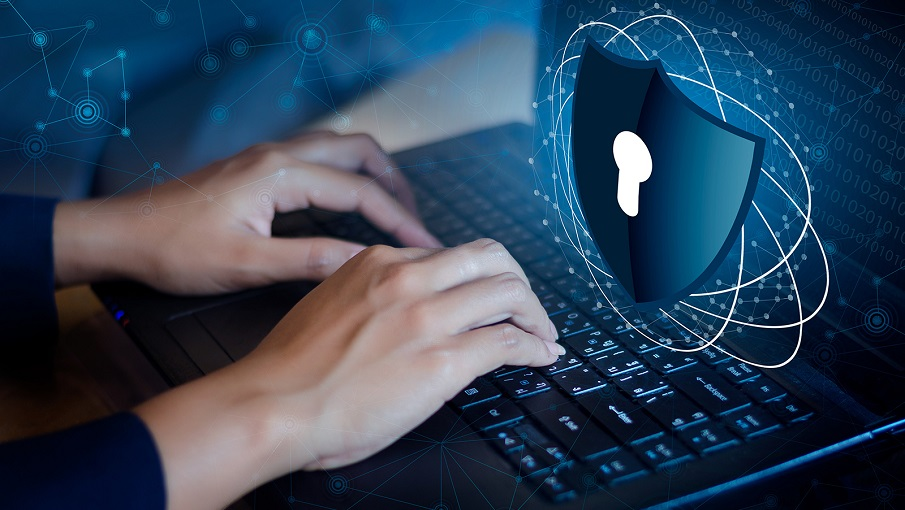

# Информационная безопасность для всех: что должен знать каждый пользователь интернета
`Распространенное заблуждение состоит в том, что личные данные рядового пользователя не представляют ценности для злоумышленников. Но практика показывает, что злоумышленники атакуют не отдельных людей, а массово всех подряд. Им нужны: учетные записи, платежные данные, доступ к устройству, медиафайлы – все те данные, которые будут востребованными активами в теневой экономике. Следовательно, защита своего информационного поля необходима каждому пользователю интернета, независимо от его статуса.`
## Что теряют обычные пользователи:

-*Деньги с карт и счетов*

-*Аккаунт в соцсетях и мессенджерах*

-*Личные данные (фото, переписки)*

-*Доступ к госуслугам и почте*

### Ключевые опасности в интернете:  

- __Фишинг__ — поддельные сайты и письма, с помощью которых злоумышленники получают пароли и данные банковских карт. Внешне такие ресурсы неотличимы от официальных сервисов банков и магазинов, поэтому человек, не задумываясь переходит на неизвестный ему сайт.
- __Мошенничество в мессенджерах__ — сообщения от имени знакомых или службы безопасности банка с просьбами перевести деньги, проголосовать или подтвердить данные.
- __Вредоносное ПО__ — вирусы и шифровальщики, распространяемые через неофициальные сборки игр и вложения в письмах, их запуск приводит к потере данных.
- __Поддельные приложения и сайты__ — копии легальных сервисов, предназначенные для кражи паролей и денежных средств.
- __Телефонное мошенничество__ — звонки от имени банка или службы безопасности с сообщениями о блокировке карты, оформлении кредита и другими ложными поводами.
#### Чтобы обезопасить себя в интернете пользователь не должен:

- [x] 1) *Переходить по подозрительным ссылкам и скачивать файлы из не проверенных источников.*

- [ ] 2) *Сообщать пароли, коды из СМС, данные карт даже «сотрудникам банка» по телефону или знакомым в переписке — так не получится стать жертвой мошенничества.*

- [ ] 3) *Оставлять в открытом доступе личные данные (адрес, телефон, дату рождения) и делать профили в соцсетях полностью публичными — это снизит риск возможных атак на основе утечек и настроек приватности.*

- [ ] 4) *Вступать в острые конфликты и обмениваться оскорблениями в онлайн-играх и мессенджерах, ведь за экраном может скрываться злоумышленник, а серьезная перепалка способна спроецировать деанон на вас.*

- [ ] 5) *Публиковать слишком много личной информации в открытом доступе.*

- [ ] 6) *Использовать VPN в публичных сетях, при подключении к общественному WI-FI (кафе, торговый центр). Шифрует весь интернет-трафик устройства.*

##### Пароли и защита аккаунтов

- Не стоит привязывать один email к разным сервисам. Лучше создавать разные почтовые адреса для каждого важного сервиса. Это усложнит задачу злоумышленникам, которые захотят собрать о вас максимум информации.
- Создавать один пароль для всех приложений. Если один сервер утечет-под угрозой окажутся все твои аккаунт.
- Создавать сложные пароли, длиной от 12-16 символов, с добавлением цифр и спецсимволов.
- Включать двухфакторную аутентификацию. Двойная проверка при входе в аккаунт.
- Не хранить важные документы, пароли и персональные данные в Telegram и других мессенджерах.
###### Что делать если ваш аккаунт взломали? 
- Завершить лишние сессии. Переходим в настройки и оставляем наш текущий сеанс и отключить все остальные, которые вам не известны.
- Обновить или установить облачный пароль.
- Оповестить, как можно больше людей, что вас взломали.
- Обратиться за помощью к специалистам или идти в полицию.
- Не нужно чистить кэш и откатывать к заводским настройкам, вместе с этим удалятся улики, которые могут помочь найти мошенника.


[подать заявление в полицию](https://мвд.рф/request_main)

[проверить утечку пароля](https://haveibeenpwned.com/Passwords "Откроется в новой вкладке")




```mermaid
graph TD
A[Сообщение] --> B{Просят код?}
B --> |Да| С[Мошенник]
B --> |Нет| В[Беспокоиться не о чем]


 
  
